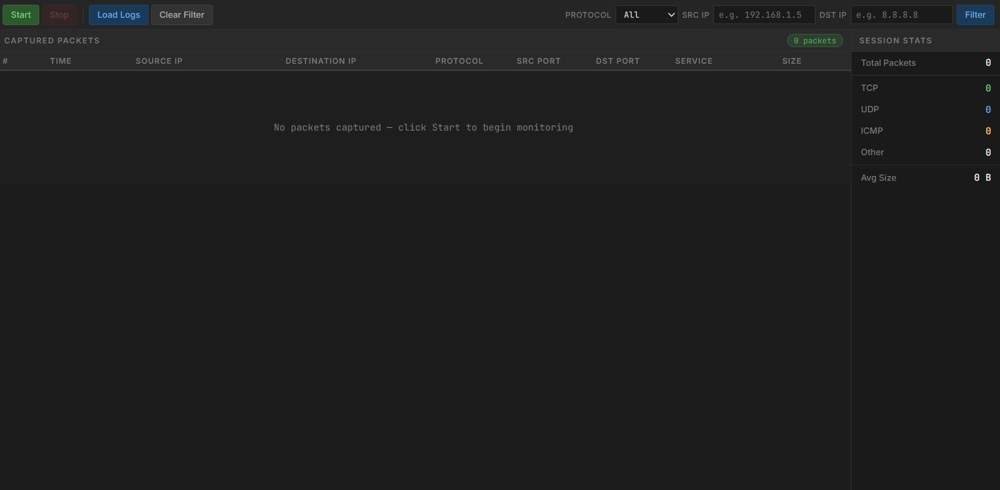
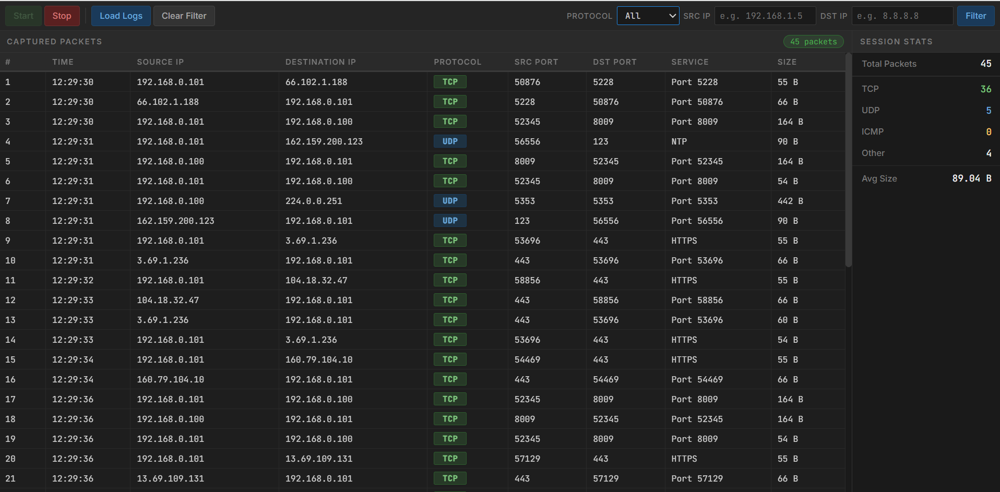
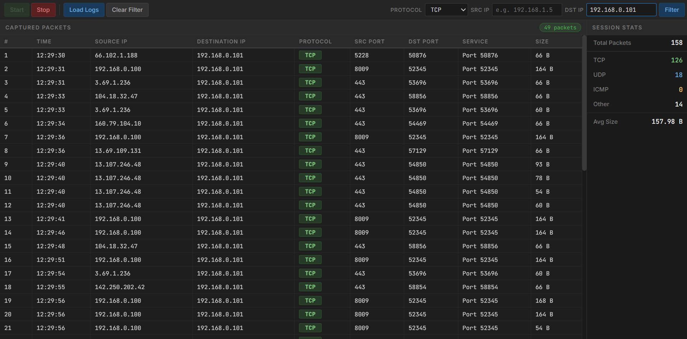
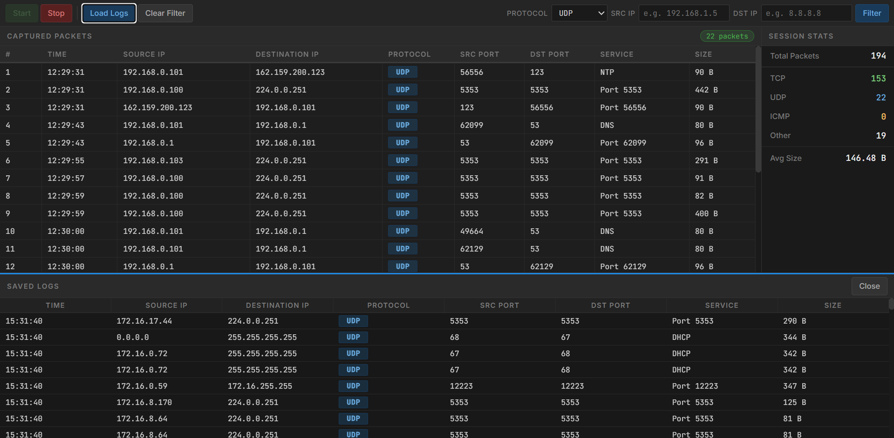

# Network Traffic Monitoring Platform

A real-time network packet capture and analysis tool built with Python and Flask. The system captures live network traffic, displays it in a web-based interface, and saves all records to a CSV log file for later review.

---

## Screenshots

### Idle State



### Live Packet Capture



### Filtered by Protocol & Destination IP



### Saved Logs Panel



---

## Features

- Real-time packet sniffing using Scapy
- Displays Source IP, Destination IP, Protocol, Ports, and Service
- Maps common port numbers to service names (HTTP, DNS, SSH, etc.)
- Filter packets by Protocol, Source IP, or Destination IP
- Live session statistics (total packets, TCP/UDP/ICMP counts, average size)
- Saves all captured packets to a CSV log file
- Load and view saved logs

---

## Project Structure

```
network_monitor/
├── app.py                  ← Flask web server
├── sniffer.py              ← Packet capture engine (Scapy)
├── traffic_log.csv         ← Auto-generated log file (created on first capture)
├── templates/
│   └── index.html          ← Web interface
└── static/
    ├── style.css           ← Styling
    └── script.js           ← Frontend logic
```

---

## Requirements

- Python 3.x
- Flask
- Scapy

---

## Installation

**Install the required libraries:**

```
pip install flask scapy
```

---

## How to Run

> **Important:** Packet sniffing requires administrator privileges to access the network adapter.

**Windows — run terminal as Administrator, then:**

```
py app.py
```

**Step 3 — Open your browser and visit:**

```
http://localhost:5000
```

---

## How to Use

| Action                  | How                                                 |
| ----------------------- | --------------------------------------------------- |
| Start capturing packets | Click the **Start** button                          |
| Stop capturing          | Click the **Stop** button                           |
| Filter by protocol      | Select TCP / UDP / ICMP from the dropdown           |
| Filter by IP address    | Type in the Src IP or Dst IP field and click Filter |
| Clear filters           | Click **Clear Filter**                              |
| View saved logs         | Click **Load Logs**                                 |
| Close logs panel        | Click **Close** inside the logs panel               |

---

## Port to Service Mapping

The system automatically identifies services from destination port numbers:

| Port | Service |
| ---- | ------- |
| 80   | HTTP    |
| 443  | HTTPS   |
| 53   | DNS     |
| 22   | SSH     |
| 25   | SMTP    |
| 3306 | MySQL   |
| 3389 | RDP     |

Any port not in the list is displayed as `Port [number]`.

---

## CSV Log File

Every captured packet is automatically saved to `traffic_log.csv` in the project folder. The file contains the following columns:

```
session, time, src_ip, dst_ip, protocol, src_port, dst_port, service, size
```

The file is never deleted between sessions — all records are preserved and new packets are appended to the existing file.

---

## Technologies Used

| Technology | Purpose                        |
| ---------- | ------------------------------ |
| Python 3   | Backend programming language   |
| Flask      | Web server framework           |
| Scapy      | Network packet capture library |
| HTML5      | Web interface structure        |
| CSS3       | Interface styling              |
| JavaScript | Frontend interactivity         |

---

## Notes

- The application must be run with administrator or root privileges for Scapy to access the network adapter
- An internet connection is required on first load to fetch the Inter and JetBrains Mono fonts from Google Fonts
- The `traffic_log.csv` file is created automatically when the first packet is captured
- Tested on Windows 11
